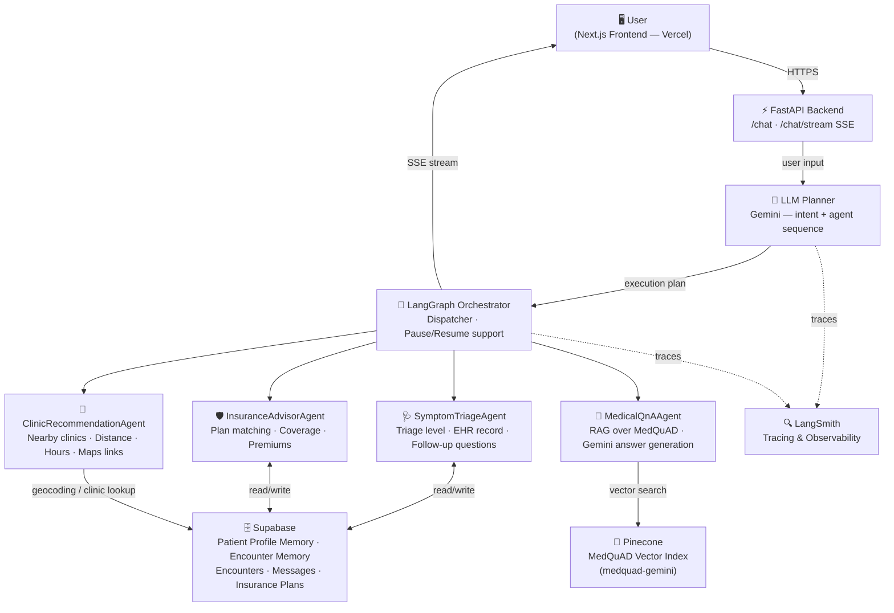

# Agentic AI Healthcare System

A full-stack, multi-agent AI healthcare assistant that helps users triage symptoms, find clinics, explore insurance plans, and get answers to medical questions — all through a conversational interface powered by LangGraph and Google Gemini.

---

## System Architecture



### How It Works

1. **User sends a message** → FastAPI receives it at `/chat` or `/chat/stream`.
2. **Planner (LLM-based)** determines the intent (e.g., `symptoms`, `clinic`, `insurance`, `medical_qna`) and produces a structured agent execution plan (`agent_sequence`).
3. **LangGraph Orchestrator** executes the plan step by step:
   - Initializes shared state.
   - Hydrates **long-term memory** (patient profile) and **encounter memory** (this chat session) from Supabase.
   - Dispatches agents in sequence based on the planner output.
   - Supports **pause/resume**: agents can ask follow-up questions and pause the graph until the user replies.
4. **Response** is streamed back to the frontend via Server-Sent Events (SSE) in real time.

---

## Agents

| Agent | Responsibility |
|---|---|
| **SymptomTriageAgent** | Analyzes reported symptoms, determines triage level (non-urgent / semi-urgent / urgent / emergency), recommends next action, and generates a structured EHR-style record. Asks follow-up questions when more info is needed. |
| **ClinicRecommendationAgent** | Finds nearby clinics using the user's GPS coordinates and required specialty. Returns top-3 clinics with distance, rating, hours, phone, Google Maps links, and recommendation reasons. |
| **InsuranceAdvisorAgent** | Matches the user's profile (age, budget, coverage needs) against available insurance plans stored in Supabase and recommends the top-3 best-fit plans with coverage details and premiums. |
| **MedicalQnAAgent** | Answers general medical questions by retrieving relevant documents from the Pinecone vector store (MedQuAD medical Q&A dataset) and generating a response with Gemini. |

---

## Memory System

The system uses a two-layer memory architecture:

- **Long-Term Memory (Patient Profile Memory)**: Stored in Supabase. Persists confirmed, non-diagnostic facts about a patient across sessions (preferences, insurance constraints, context topics). Keyed by `patient_id`.
- **Encounter Memory**: Stored in Supabase. Conversation-scoped context (recent topics, intent, active Q&A state). Isolated per `encounter_id` to prevent cross-contamination between different chats.

Memory is hydrated at the start of each orchestration run and written back only when an agent produces confirmed, high-confidence facts.

---

## Backend

- **Framework**: FastAPI + Uvicorn
- **Entrypoint**: `app/entrypoints/chat_server.py`
- **Endpoints**:
  - `GET /health` — health check
  - `GET /` — API info
  - `POST /chat` — synchronous chat (returns full response)
  - `POST /chat/stream` — streaming chat via SSE (real-time agent status + response)
- **Session state**: In-memory TTL store (30 min) tracks conversation state across turns

### Request Body (`/chat` and `/chat/stream`)

```json
{
  "input": "I have chest pain",
  "session_id": "abc-123",
  "encounter_id": "optional-uuid",
  "patient_id": "optional-uuid",
  "user_coordinates": [3.139, 101.686],
  "age": 32,
  "sex": "male",
  "chronic_conditions": ["hypertension"],
  "medications": ["amlodipine"],
  "allergies": [],
  "duration": "2 days",
  "severity": "moderate"
}
```

---

## Frontend

- **Framework**: Next.js 16 (React 19)
- **UI**: ShadCN components + Tailwind CSS + Radix UI
- **Auth**: Supabase Auth (SSR)
- **Deployment**: Vercel

To run locally:
```bash
cd Frontend
npm install
npm run dev        # Starts on http://localhost:3001
```

---

## Tech Stack

| Layer | Technology |
|---|---|
| LLM | Google Gemini (`gemini-3-flash-preview`) |
| Agent Framework | LangGraph + LangChain |
| Tracing | LangSmith |
| Vector Search | Pinecone (`medquad-gemini` index) |
| Database / Auth | Supabase (PostgreSQL) |
| Backend API | FastAPI + Uvicorn |
| Frontend | Next.js 16 + React 19 |
| Containerization | Docker |
| Backend Hosting | Render (Docker, auto-deploy from `main`) |
| Frontend Hosting | Vercel |

---

## Setup

### Prerequisites
- Python 3.10+
- Node.js 18+
- A Supabase project with the required tables
- Pinecone account with a `medquad-gemini` index
- Google Gemini API key
- LangSmith API key

### Backend

```bash
# Create and activate virtual environment
python -m venv venv
source venv/bin/activate      # Windows: venv\Scripts\activate

# Install dependencies
pip install -r requirements.txt

# Create .env in the project root (see below)
uvicorn app.entrypoints.chat_server:app --host 0.0.0.0 --port 8000 --reload
```

### Frontend

```bash
cd Frontend
npm install
# Create Frontend/.env.local (see below)
npm run dev
```

---

## Environment Variables

### Backend (`.env`)

```env
# LangSmith tracing
LANGCHAIN_TRACING_V2=true
LANGCHAIN_ENDPOINT=https://api.smith.langchain.com
LANGCHAIN_API_KEY=your-langsmith-key
LANGCHAIN_PROJECT=AI-HEALTHCARE-AGENT

# Pinecone
PINECONE_API_KEY=your-pinecone-key
PINECONE_ENVIRONMENT=us-east-1-aws
PINECONE_INDEX_NAME=medquad-gemini
VECTOR_STORE_MODE=cloud

# Supabase
SUPABASE_URL=https://your-project.supabase.co
SUPABASE_ANON_KEY=your-anon-key
SUPABASE_SERVICE_ROLE_KEY=your-service-role-key
DATABASE_URL=postgresql://...

# LLM
LLM_PROVIDER=gemini
GEMINI_API_KEY=your-gemini-key
GEMINI_MODEL=gemini-3-flash-preview

# OpenAI (optional fallback)
OPENAI_API_KEY=your-openai-key
OPENAI_MODEL=gpt-4o-mini
```

### Frontend (`Frontend/.env.local`)

```env
NEXT_PUBLIC_SUPABASE_URL=https://your-project.supabase.co
NEXT_PUBLIC_SUPABASE_ANON_KEY=your-anon-key
NEXT_PUBLIC_API_URL=https://your-backend.onrender.com
```

---

## Project Structure

```
Agentic AI Healthcare/
├── app/
│   ├── agents/
│   │   ├── planner.py                  # LLM-based intent parser & agent sequencer
│   │   ├── symptom_triage_agent.py     # Symptom triage logic
│   │   ├── clinic_recommendation_agent.py
│   │   ├── insurance_recommendation_agent.py
│   │   └── structured_extraction.py   # LLM structured output helpers
│   ├── workflows/
│   │   ├── orchestrator_graph.py       # LangGraph multi-agent graph
│   │   ├── medical_qa_graph.py         # Medical Q&A sub-graph (Pinecone RAG)
│   │   └── healthcare_graph.py         # Legacy simple graph
│   ├── entrypoints/
│   │   ├── chat_server.py              # FastAPI app (main server)
│   │   └── chat_stream.py              # SSE streaming logic
│   ├── tools/
│   │   ├── memory.py                   # Long-term patient profile memory (Supabase)
│   │   ├── encounter_memory.py         # Encounter-scoped session memory
│   │   ├── memory_hydration.py         # Unified memory hydration
│   │   ├── chat_persistence.py         # Chat message/encounter persistence
│   │   ├── patient_data.py             # Patient data retrieval
│   │   ├── geocoding.py                # Location/geocoding utilities
│   │   ├── pinecone_tool.py            # Pinecone client helper
│   │   └── supabase_tool.py            # Supabase client helper
│   ├── core/
│   │   └── config.py                   # Settings (env-driven via Pydantic)
│   ├── prompts/
│   │   └── planner_prompt.py           # System prompt for the Planner LLM
│   └── utils/
│       ├── status_messages.py          # Agent status message helpers
│       └── sse_utils.py                # SSE event emitters
├── Frontend/                           # Next.js frontend (deployed on Vercel)
├── Dockerfile                          # Docker image for backend
├── render.yaml                         # Render deployment config
└── requirements.txt                    # Python dependencies
```

---

## Deployment

### Backend — Render

The backend is containerized with Docker and auto-deployed to Render from the `main` branch.

```bash
# Build and run locally with Docker
docker build -t agentic-healthcare .
docker run -p 8000:8000 --env-file .env agentic-healthcare
```

Render deployment is configured in `render.yaml`. Set all secrets marked `sync: false` in the Render dashboard.

### Frontend — Vercel

Deploy the `Frontend/` directory to Vercel. Set the environment variables in the Vercel project settings.

---

## Supabase Tables Required

| Table | Purpose |
|---|---|
| `Patient Data` | Core patient registry (used as FK parent) |
| `Patient Profile Memory` | Long-term cross-session memory per patient |
| `Encounter Memory` | Per-conversation short-term context |
| `Encounters` | Chat session / encounter records |
| `Messages` | Persisted chat message history |
| Insurance plans table | Insurance plan catalogue queried by InsuranceAdvisorAgent |
